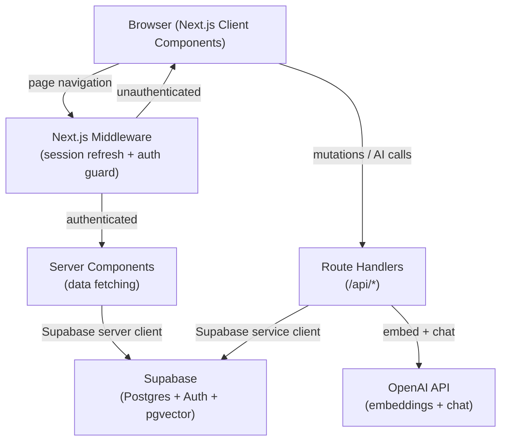
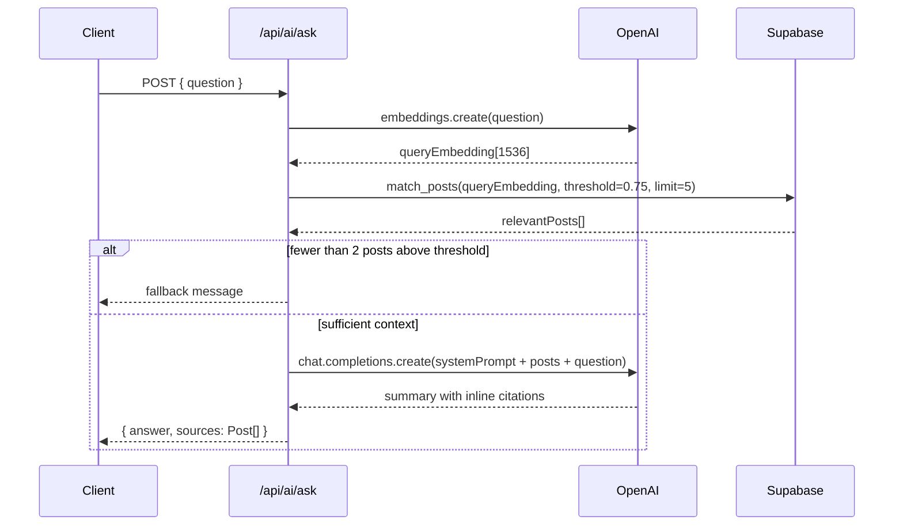

# Design Document: MustangLink

## Overview

MustangLink is a Cal Poly-exclusive community platform built as a Next.js App Router application backed by Supabase (Postgres + Auth). It consolidates four hubs — Rideshare, Lost & Found, Questions, and Opportunities — behind a verified @calpoly.edu email gate, and adds an AI assistant that answers student questions by retrieving and summarizing real posts using Retrieval-Augmented Generation (RAG).

### Key Design Decisions

- **Next.js App Router** with Server Components for data fetching and Route Handlers for API endpoints. This keeps the stack simple and avoids a separate backend service.
- **Supabase Auth** handles email/password sign-up with domain validation enforced at the application layer (middleware + API route) before the Supabase call, since Supabase itself does not natively restrict email domains.
- **pgvector** (built into Supabase) stores OpenAI embeddings alongside posts, eliminating the need for a separate vector database.
- **`text-embedding-3-small`** (1536 dimensions, $0.02/1M tokens) is chosen for embeddings — cost-effective for a hackathon scale and well-suited for semantic search.
- **`gpt-4o-mini`** is used for summarization and category suggestion — fast, cheap, and sufficient for the task.
- **RAG pipeline** runs entirely in a single Next.js Route Handler: embed query → cosine similarity search via pgvector → summarize with GPT.

---

## Architecture



### Request Flow

1. Every request passes through Next.js Middleware, which refreshes the Supabase session cookie and redirects unauthenticated users to `/login`.
2. Page data is fetched in Server Components using the Supabase server client (reads the session cookie).
3. Mutations (create/edit/delete post, submit comment, AI query) go through Route Handlers that verify the session and apply Row Level Security (RLS) via the Supabase server client.
4. The AI assistant Route Handler embeds the user query, runs a pgvector similarity search, then calls GPT to summarize the retrieved posts.

---

## Components and Interfaces

### Next.js Route Handlers (`/app/api/`)

| Route | Method | Description |
|---|---|---|
| `/api/auth/signup` | POST | Validates @calpoly.edu domain, calls Supabase sign-up |
| `/api/posts` | POST | Creates a new post in the appropriate hub table |
| `/api/posts/[id]` | PUT | Updates a post (author-only, enforced by RLS) |
| `/api/posts/[id]` | DELETE | Deletes a post and cascades to comments |
| `/api/comments` | POST | Adds a comment to a post |
| `/api/ai/ask` | POST | RAG pipeline: embed → search → summarize |
| `/api/ai/suggest-category` | POST | Suggests hub + category from draft title/body |

### Next.js Pages (`/app/`)

| Route | Description |
|---|---|
| `/` | Home page — hub cards with post counts |
| `/login` | Sign-in form |
| `/signup` | Sign-up form |
| `/[hub]` | Hub feed — list of posts with search/filter |
| `/[hub]/new` | Post creation form |
| `/[hub]/[id]` | Post detail page with comments |
| `/[hub]/[id]/edit` | Post edit form (author only) |

### Key Client Components

- **`<NavBar />`** — persistent navigation with hub links and AI chat icon; collapses to hamburger below 768px.
- **`<AIChatDrawer />`** — slide-in chat panel accessible from all authenticated pages.
- **`<PostForm hub={...} />`** — renders hub-specific fields based on the `hub` prop.
- **`<SearchBar />`** — controlled input that triggers filtered queries.
- **`<CategorySuggest />`** — debounced hook that calls `/api/ai/suggest-category` as the user types.

### Supabase Client Utilities

```
lib/supabase/
  server.ts      # createServerClient() — for Server Components and Route Handlers
  client.ts      # createBrowserClient() — for Client Components
```

Both use `@supabase/ssr` to handle cookie-based sessions correctly in the App Router.

---

## Data Models

### Database Schema

Enable the pgvector extension first:

```sql
create extension if not exists vector;
```

#### `profiles` table

Extends Supabase Auth users with display information.

```sql
create table profiles (
  id          uuid primary key references auth.users(id) on delete cascade,
  display_name text not null,
  email       text not null,
  created_at  timestamptz not null default now()
);

-- Auto-create profile on sign-up
create or replace function handle_new_user()
returns trigger language plpgsql security definer as $$
begin
  insert into profiles (id, display_name, email)
  values (new.id, split_part(new.email, '@', 1), new.email);
  return new;
end;
$$;

create trigger on_auth_user_created
  after insert on auth.users
  for each row execute procedure handle_new_user();
```

#### `posts` table

Single polymorphic table for all hubs. Hub-specific fields are stored in a `metadata` JSONB column to keep the schema simple for the hackathon.

```sql
create table posts (
  id            uuid primary key default gen_random_uuid(),
  hub           text not null check (hub in ('rideshare', 'lost_found', 'questions', 'opportunities')),
  user_id       uuid not null references profiles(id) on delete cascade,
  title         text not null,
  body          text not null default '',
  category      text,
  metadata      jsonb not null default '{}',
  embedding     vector(1536),
  created_at    timestamptz not null default now(),
  updated_at    timestamptz not null default now()
);

create index posts_hub_created_at_idx on posts (hub, created_at desc);
create index posts_embedding_idx on posts using ivfflat (embedding vector_cosine_ops)
  with (lists = 100);
```

**`metadata` shape per hub:**

| Hub | Fields in `metadata` |
|---|---|
| `rideshare` | `origin`, `destination`, `departure_date`, `departure_time`, `available_seats`, `notes` |
| `lost_found` | `item_name`, `item_description`, `last_seen_location`, `date_lost_found`, `status` (`lost`/`found`), `image_url` |
| `questions` | *(title + body carry the content; category is top-level)* |
| `opportunities` | `opportunity_type` (`job`/`event`/`item_for_sale`), `contact_info` |

#### `comments` table

```sql
create table comments (
  id         uuid primary key default gen_random_uuid(),
  post_id    uuid not null references posts(id) on delete cascade,
  user_id    uuid not null references profiles(id) on delete cascade,
  body       text not null,
  created_at timestamptz not null default now()
);

create index comments_post_id_created_at_idx on comments (post_id, created_at asc);
```

### Row Level Security Policies

```sql
-- profiles: users can read all, update only their own
alter table profiles enable row level security;
create policy "profiles_select" on profiles for select using (true);
create policy "profiles_update" on profiles for update using (auth.uid() = id);

-- posts: anyone authenticated can read; only author can insert/update/delete
alter table posts enable row level security;
create policy "posts_select" on posts for select using (auth.role() = 'authenticated');
create policy "posts_insert" on posts for insert with check (auth.uid() = user_id);
create policy "posts_update" on posts for update using (auth.uid() = user_id);
create policy "posts_delete" on posts for delete using (auth.uid() = user_id);

-- comments: same pattern as posts
alter table comments enable row level security;
create policy "comments_select" on comments for select using (auth.role() = 'authenticated');
create policy "comments_insert" on comments for insert with check (auth.uid() = user_id);
create policy "comments_delete" on comments for delete using (auth.uid() = user_id);
```

### TypeScript Types

```typescript
type Hub = 'rideshare' | 'lost_found' | 'questions' | 'opportunities';

interface Post {
  id: string;
  hub: Hub;
  user_id: string;
  title: string;
  body: string;
  category: string | null;
  metadata: Record<string, unknown>;
  created_at: string;
  updated_at: string;
  profiles?: { display_name: string };
}

interface Comment {
  id: string;
  post_id: string;
  user_id: string;
  body: string;
  created_at: string;
  profiles?: { display_name: string };
}
```

---

## AI Retrieval and Summarization System

### RAG Pipeline (`/api/ai/ask`)



### pgvector Similarity Search Function

```sql
create or replace function match_posts(
  query_embedding vector(1536),
  similarity_threshold float,
  match_count int
)
returns table (
  id uuid,
  hub text,
  title text,
  body text,
  category text,
  metadata jsonb,
  created_at timestamptz,
  similarity float
)
language sql stable as $$
  select
    p.id, p.hub, p.title, p.body, p.category, p.metadata, p.created_at,
    1 - (p.embedding <=> query_embedding) as similarity
  from posts p
  where 1 - (p.embedding <=> query_embedding) > similarity_threshold
  order by p.embedding <=> query_embedding
  limit match_count;
$$;
```

### Embedding Generation

Embeddings are generated when a post is created or updated. The text fed to the embedding model is:

```
{hub}: {title}\n{body}\n{JSON.stringify(metadata)}
```

This is done in the `/api/posts` Route Handler after persisting the post, using a background call so it does not block the response.

### Summarization Prompt

```
System: You are a helpful assistant for Cal Poly students. Answer the student's question 
using ONLY the posts provided below. For each claim, cite the source post using [Post: {title}] 
inline. If the provided posts do not contain enough information, say so explicitly.

Posts:
{retrieved posts formatted as title + body}

Student question: {question}
```

### Category Suggestion (`/api/ai/suggest-category`)

A lightweight call to `gpt-4o-mini` with a structured output prompt:

```
Given this draft post title and body, suggest the most appropriate hub 
(rideshare | lost_found | questions | opportunities) and category 
(clubs | fraternities | classes | housing | campus_life | job | event | item_for_sale | other).
Return JSON: { "hub": "...", "category": "..." }

Title: {title}
Body: {body}
```

The client debounces this call by 600ms and only fires when `title.length + body.length >= 10`.

---

## Correctness Properties

*A property is a characteristic or behavior that should hold true across all valid executions of a system — essentially, a formal statement about what the system should do. Properties serve as the bridge between human-readable specifications and machine-verifiable correctness guarantees.*

### Property 1: Non-@calpoly.edu emails are always rejected

*For any* email string that does not end with `@calpoly.edu`, the `validateCalPolyEmail` function SHALL return an error and SHALL NOT proceed to create a Supabase account.

**Validates: Requirements 1.2**

---

### Property 2: Hub feed is always sorted newest-first

*For any* set of posts belonging to a hub, the list returned by the hub feed query SHALL be sorted in descending order by `created_at` — no two adjacent posts shall be out of order.

**Validates: Requirements 2.2**

---

### Property 3: Form validation rejects any missing required field

*For any* hub post creation form and *any* non-empty subset of required fields that are left blank, the form submission SHALL be prevented and all blank required fields SHALL be highlighted.

**Validates: Requirements 3.6**

---

### Property 4: Every post is stamped with the correct author and UTC timestamp

*For any* post created by any authenticated user, the persisted post SHALL have `user_id` equal to the creating user's ID and `created_at` SHALL be a valid UTC timestamp within a reasonable clock skew of the creation time.

**Validates: Requirements 3.7**

---

### Property 5: Any non-empty comment is persisted and retrievable

*For any* non-empty string submitted as a comment on any post, the comment SHALL be persisted to the database and SHALL be retrievable by querying comments for that post.

**Validates: Requirements 4.2**

---

### Property 6: Whitespace-only comments are always rejected

*For any* string composed entirely of whitespace characters (including the empty string), submitting it as a comment SHALL be rejected and the comment count for the post SHALL remain unchanged.

**Validates: Requirements 4.3**

---

### Property 7: Comments are always displayed in ascending timestamp order

*For any* set of comments on any post, the list returned by the comment query SHALL be sorted in ascending order by `created_at`.

**Validates: Requirements 4.4**

---

### Property 8: Search results always contain the query string (case-insensitive)

*For any* search query string and *any* set of posts in a hub, every post returned by the search SHALL have the query string present (case-insensitively) in its `title` or `body`, and no post containing the query string SHALL be omitted from the results.

**Validates: Requirements 5.1**

---

### Property 9: Category, status, and date filters are always exclusive

*For any* filter value applied in any hub (category in Questions, status in Lost & Found, departure date in Rideshare), every post in the result set SHALL match the filter predicate, and no post that matches the predicate SHALL be absent from the results.

**Validates: Requirements 5.2, 5.3, 5.4**

---

### Property 10: Displayed result count always equals actual result count

*For any* active search or filter state, the count displayed above the results list SHALL equal the number of posts in the result list.

**Validates: Requirements 5.5**

---

### Property 11: Clearing filters restores the full unfiltered post list

*For any* hub and *any* combination of filters applied, clearing all filters SHALL produce a result set identical to the unfiltered hub feed.

**Validates: Requirements 5.6**

---

### Property 12: AI responses always include source post references

*For any* set of retrieved posts used to generate an AI summary, the response text SHALL contain at least one inline citation referencing a source post from the retrieved set.

**Validates: Requirements 6.2**

---

### Property 13: Insufficient context always triggers the fallback message

*For any* query that retrieves fewer than 2 posts with similarity above the configured threshold, the AI assistant SHALL return the fallback message and SHALL NOT call the summarization LLM.

**Validates: Requirements 6.4**

---

### Property 14: Category suggestion is always returned for drafts with ≥ 10 characters

*For any* draft title + body combination whose combined character count is ≥ 10, the `/api/ai/suggest-category` endpoint SHALL return a valid hub and category value.

**Validates: Requirements 7.1**

---

### Property 15: No category suggestion for drafts with < 10 characters

*For any* draft title + body combination whose combined character count is < 10, the category suggestion SHALL NOT be displayed.

**Validates: Requirements 7.3**

---

### Property 16: Post edits are always persisted correctly

*For any* valid edit submitted by the post's author, the updated field values SHALL be reflected in the database and on the post detail page after the edit.

**Validates: Requirements 8.2**

---

### Property 17: Deleting a post always removes all associated comments

*For any* post with any number of associated comments, confirming deletion of the post SHALL remove the post record and all comment records with that `post_id` from the database.

**Validates: Requirements 8.3**

---

### Property 18: Non-authors always receive 403 on edit or delete

*For any* post and *any* authenticated user who is not the post's author, an attempt to edit or delete that post via the API SHALL return HTTP 403 Forbidden.

**Validates: Requirements 8.4**

---

## Error Handling

| Scenario | Handling |
|---|---|
| Unauthenticated request to protected route | Middleware redirects to `/login` |
| Non-@calpoly.edu sign-up | API returns 400 with message "Only @calpoly.edu email addresses are allowed." |
| Invalid login credentials | Supabase returns error; UI shows "Invalid email or password" |
| Post creation with missing required fields | Client-side validation highlights fields; form not submitted |
| Edit/delete by non-author | RLS policy causes Supabase to return 0 rows; Route Handler returns 403 |
| AI query with insufficient context | Route Handler returns fallback message without calling GPT |
| OpenAI API timeout or error | Route Handler returns 503 with message "AI assistant is temporarily unavailable" |
| Supabase query error | Route Handler returns 500; client shows generic error toast |
| Image upload exceeds size limit | Client validates file size (< 5MB) before upload; shows error if exceeded |

---

## Testing Strategy

### Dual Testing Approach

Unit tests cover specific examples, edge cases, and error conditions. Property-based tests verify universal invariants across many generated inputs. Together they provide comprehensive coverage without redundancy.

### Property-Based Testing

**Library**: [fast-check](https://fast-check.dev/) (TypeScript-native, works in Node.js and browser environments)

**Configuration**: Each property test runs a minimum of 100 iterations (`numRuns: 100`).

**Tag format**: Each test is tagged with a comment:
`// Feature: mustang-link, Property {N}: {property_text}`

**Properties to implement as PBT tests:**

| Property | Test file | fast-check arbitraries |
|---|---|---|
| P1: Email validation | `lib/__tests__/auth.test.ts` | `fc.emailAddress()` filtered to exclude @calpoly.edu |
| P2: Hub feed sort order | `lib/__tests__/posts.test.ts` | `fc.array(fc.record({ created_at: fc.date() }))` |
| P3: Form validation | `components/__tests__/PostForm.test.tsx` | `fc.subarray(requiredFields)` |
| P4: Post author + timestamp | `app/api/__tests__/posts.test.ts` | `fc.uuid()`, `fc.string()` |
| P5: Comment persistence | `app/api/__tests__/comments.test.ts` | `fc.string({ minLength: 1 })` |
| P6: Whitespace comment rejection | `lib/__tests__/validation.test.ts` | `fc.string().filter(s => s.trim() === '')` |
| P7: Comment sort order | `lib/__tests__/comments.test.ts` | `fc.array(fc.record({ created_at: fc.date() }))` |
| P8: Search correctness | `lib/__tests__/search.test.ts` | `fc.string()`, `fc.array(postArbitrary)` |
| P9: Filter exclusivity | `lib/__tests__/search.test.ts` | `fc.constantFrom(...categories)`, `fc.array(postArbitrary)` |
| P10: Count accuracy | `lib/__tests__/search.test.ts` | `fc.array(postArbitrary)`, `fc.string()` |
| P11: Filter round-trip | `lib/__tests__/search.test.ts` | `fc.record({ category, status, date })` |
| P12: AI response citations | `lib/__tests__/ai.test.ts` | `fc.array(postArbitrary, { minLength: 2 })` |
| P13: Fallback on low context | `lib/__tests__/ai.test.ts` | `fc.array(postArbitrary, { maxLength: 1 })` |
| P14: Suggestion for long drafts | `lib/__tests__/ai.test.ts` | `fc.string({ minLength: 10 })` |
| P15: No suggestion for short drafts | `lib/__tests__/ai.test.ts` | `fc.string({ maxLength: 9 })` |
| P16: Edit persistence | `app/api/__tests__/posts.test.ts` | `fc.record({ title: fc.string(), body: fc.string() })` |
| P17: Cascade delete | `app/api/__tests__/posts.test.ts` | `fc.array(commentArbitrary)` |
| P18: 403 for non-authors | `app/api/__tests__/posts.test.ts` | `fc.uuid()` (non-author user IDs) |

### Unit / Integration Tests

- **Auth flow**: Example-based tests for sign-up, login, sign-out, and email verification using Supabase test helpers.
- **RLS policies**: Integration tests against a local Supabase instance (via `supabase start`) verifying that RLS blocks unauthorized access.
- **AI pipeline wiring**: Mock OpenAI and Supabase clients; verify the RAG pipeline calls embedding → search → summarize in order.
- **UI components**: React Testing Library snapshot tests for `<NavBar />`, `<PostForm />`, and `<AIChatDrawer />`.

### Hackathon MVP Test Scope

For the hackathon, prioritize:
1. P1 (email validation) — security-critical
2. P3 (form validation) — user-facing correctness
3. P8 (search correctness) — core feature
4. P13 (AI fallback) — prevents bad AI responses
5. P18 (403 for non-authors) — security-critical

The remaining properties can be added incrementally after the hackathon.
